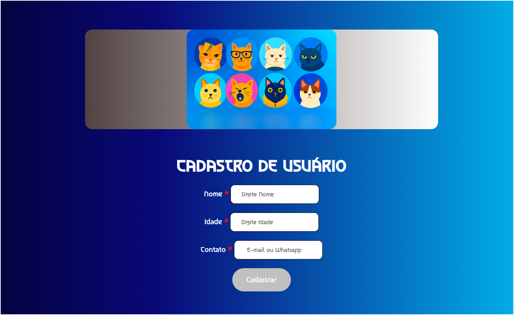
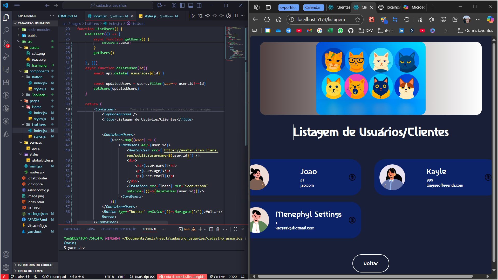

styled components

react hooks
axios 
api interna do nodenotes
react-router-dom to make a spa aplication
como fazer transição de dados de um lugar para outro 
props e prototipagem
useNavigate da biblioteca react-router-dom
toda vez que eu tiver um onclick para executar uma função que pega algum parametro, preciso colocar em arrow function
ex:  
<code>
 <Button type='button' onClick={() => navigate('/listusers')}>
 </code>

 useEffect -> efeitos colaterais. toda vez que a tela carrega, ele é acionado. 
 toda vez que uma variavel muda de valor, ele é chamado
precisa importar como todo componente react

const users =[]
const clients=[]

UseState 
para pegar dados e aplicá-los de uma api para o front e usá-los na tela. 

api <AvatarUser src={`https://avatar.iran.liara.run/public?username=${user.id}`}/>

display grid

