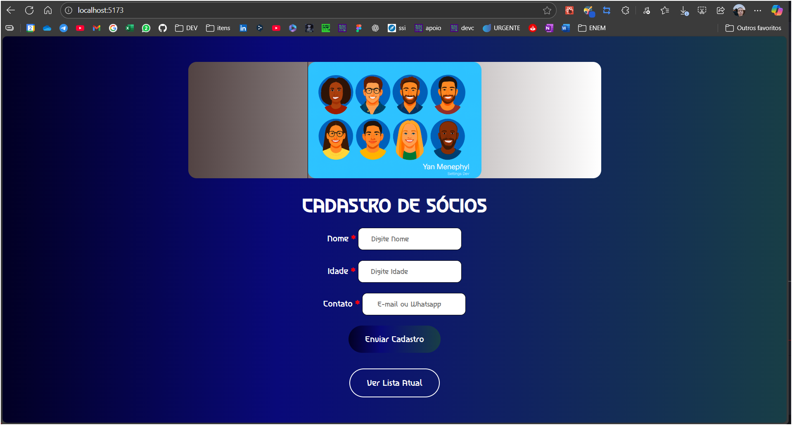
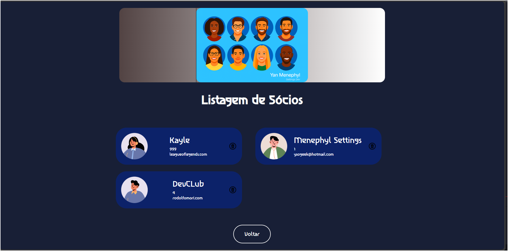
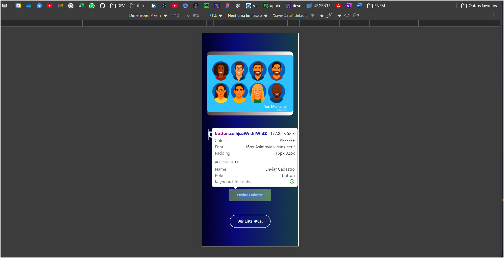
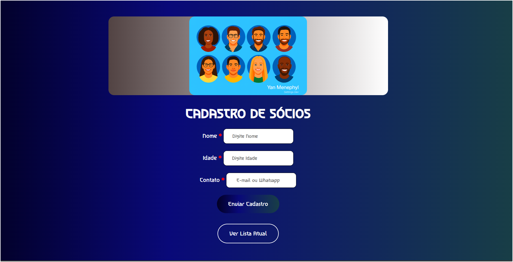
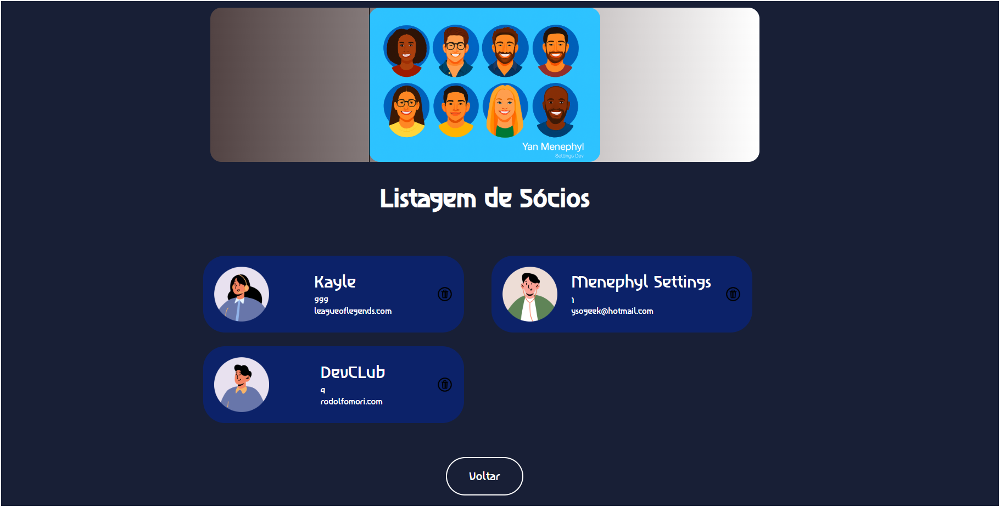
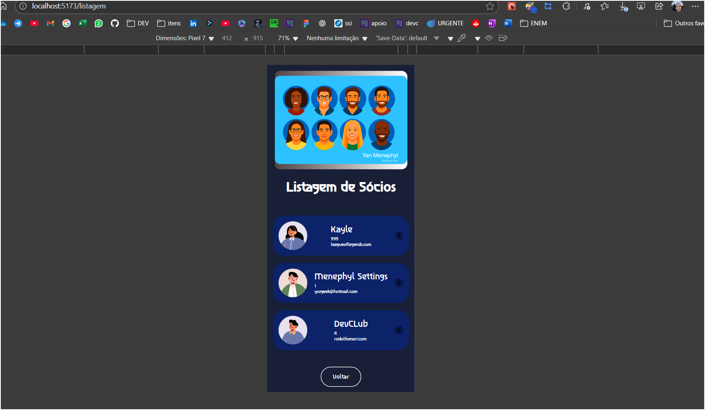
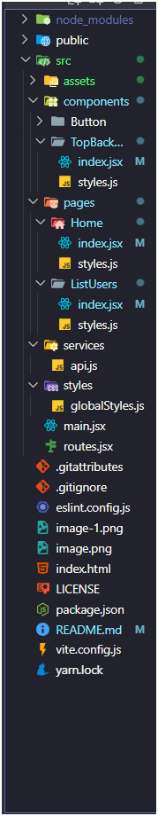

Projeto: Cadastro de Usuários (node-notes + React)
Mini aplicação full Stack

Repositório unificado das anotações e práticas de back-end-<a href="https://github.com/Menephyl/node-notes" target="_blank"> de nodeNotes </a>

 (Express + Prisma) e front-end (React + Vite) para uma aplicação de<a href="https://github.com/Menephyl/cadastro_usuarios" target="_blank"> cadastro de usuários. </a>

Projeto: Cadastro de Usuários

Repositório unificado de anotações e práticas para um mini-CRUD completo em Node.js (Express + Prisma) e React (Vite).

📖 Descrição
Este projeto demonstra como criar uma aplicação de cadastro de usuários com:

Front-end em React yarn + Vite 

Vite como bundler

styled-components para estilos

axios para chamadas à API interna

React Router para navegação SPA

React Hooks (useRef, useState, useEffect)

🚀 Tecnologias
Node.js

Express

Prisma (SQLite ou PostgreSQL)

Cors

React

Vite

styled-components

axios

react-router-dom

⚙️ Back-end
Instalação e configuração
Clone o repositório

Acesse a pasta do back-end

bash
cd node-notes
Instale dependências

bash
npm install
Crie o arquivo .env com sua string de conexão:

Código
DATABASE_URL="file:./dev.db"
Gere o cliente Prisma e aplique migrações:

bash
npx prisma migrate dev --name init
npx prisma generate
Endpoints disponíveis
Método	Endpoint	Descrição
GET	/usuarios	Lista todos os usuários
POST	/usuarios	Cria um novo usuário
PUT	/usuarios/:id	Atualiza usuário pelo ID
DELETE	/usuarios/:id	Deleta usuário pelo ID
Executar o servidor
bash
npm run dev
# ou
node --watch server.js
Saída esperada: Servidor rodando na porta 3000

🎨 Front-end
Instalação
Acesse a pasta do front-end

bash
cd cadastro_usuarios
Instale dependências

bash
npm install
Inicie o servidor de desenvolvimento

bash
npm run dev
Páginas principais
Home (/)

Formulário de cadastro com campos para nome, idade e contato

Usa useRef para capturar valores

Chama POST /usuarios e redireciona para /listagem

Listagem (/listagem)

Busca GET /usuarios para exibir os usuários

Cada card exibe nome, idade, e-mail e ícone de lixeira

Ao clicar no ícone, chama DELETE /usuarios/:id e atualiza a lista

Componentes-chave
TopBackground: banner decorativo no topo

Button: botões estilizados com styled-components

Formulários: uso de useRef e tratamento de eventos

Axios: cliente configurado em /src/services/api.js

React Router: navegação com useNavigate e <Routes>

🗂 Estrutura de Pastas

Código
/
├── node-notes/               # Back-end (Express + Prisma)
│   ├── prisma/
│   │   └── schema.prisma
│   ├── server.js
│   ├── package.json
│   └── .env
└── cadastro_usuarios/        # Front-end (React + Vite)
    ├── public/
    ├── src/
    │   ├── assets/           # Imagens e ícones
    │   ├── components/       # Button, TopBackground, etc.
    │   ├── pages/
    │   │   ├── Home/
    │   │   └── ListUsers/
    │   ├── services/         # Cliente axios
    │   ├── styles/           # Styled-components e temas
    │   └── App.jsx
    ├── package.json
    └── vite.config.js
    
📸 Screenshots

⚙️ Back-end= server.js 
Configuração do MongoDB Atlas

Crie um cluster no MongoDB Atlas (por exemplo, chamado project-0).

Em Network Access, adicione seu IP público (ou 0.0.0.0/0 durante o desenvolvimento) para liberar a conexão.

No Atlas, copie a connection string (algo como mongodb+srv://<usuário>:<senha>@cluster0.mongodb.net/project-0?retryWrites=true&w=majority).

Crie um arquivo .env na raiz de node-notes com:

Código
DATABASE_URL="mongodb+srv://<usuário>:<senha>@cluster0.mongodb.net/project-0?retryWrites=true&w=majority"
O mini-CRUD do back-end persistirá e recuperará todos os registros de usuários diretamente neste banco project-0.

Instalação e configuração
Clone o repositório

Acesse o link do back-end no repositorio node-notes 

Instale dependências

bash
npm ou yarn  install
Gere o cliente Prisma e aplique migrações (se houver alterações no schema)

bash
npx prisma migrate dev --name init
npx prisma generate
Endpoints disponíveis
Método	Endpoint	Descrição
GET	/usuarios	Lista todos os usuários
POST	/usuarios	Cria um novo usuário
PUT	/usuarios/:id	Atualiza usuário pelo ID
DELETE	/usuarios/:id	Deleta usuário pelo ID
Executar o servidor
bash
npm run dev

# ou
node --watch server.js
Saída esperada: servidor rodando na porta 3000

RESPONSIVIDADE - 
.

.

.
🤝 Contribuições
Este projeto está aberto a pull requests e issues. Consulte as documentações oficiais de Express, Prisma e Vite para mais detalhes.

📝 Licença
Este projeto está licenciado sob a MIT License. Consulte o arquivo LICENSE para mais informações.
